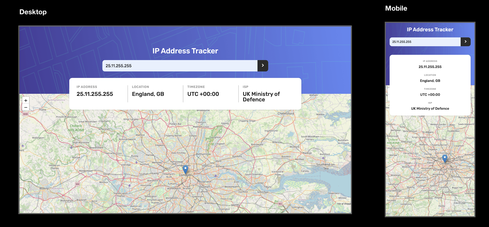

# IP address tracker

This is a solution to the [IP address tracker challenge on Frontend Mentor](https://www.frontendmentor.io/challenges/ip-address-tracker-I8-0yYAH0).

## Table of contents

- [Overview](#overview)
  - [The challenge](#the-challenge)
  - [Screenshot](#screenshot)
  - [Links](#links)
- [My process](#my-process)
  - [Built with](#built-with)
  - [What I learned](#what-i-learned)
  - [Continued development](#continued-development)
  - [Useful resources](#useful-resources)
- [Author](#author)
- [Acknowledgments](#acknowledgments)

## Overview

### The challenge

Users should be able to:

- View the optimal layout for each page depending on their device's screen size
- See hover states for all interactive elements on the page
- See their own IP address on the map on the initial page load
- Search for any IP addresses or domains and see the key information and location

### Screenshot



### Links

- [Solution URL](https://github.com/sree-lakshmi-n/ip-address-tracker)
- [Live Site URL](https://sree-lakshmi-n.github.io/ip-address-tracker)

## My process

### Built with

- Semantic HTML5 markup
- CSS custom properties
- Flexbox
- CSS Grid
- Desktop-first workflow
- [Sass](https://sass-lang.com/)

### What I learned

Learnt to make an API call using fetch API, Async and Await.

```js
async function getQuote() {
  let response = await fetch(url);
  let data = await response.json();
  return data;
}

getQuote().then((data) => console.log(data));
```

For getting client's IP address using Geo Ipify API, the url is

```js
"https://geo.ipify.org/api/v2/country,city?apiKey=at_vMIjof1g6XVqaF1luAuKpjEHZwIvf";
```

Else, the url is

```js
"https://geo.ipify.org/api/v2/country,city?apiKey=at_vMIjof1g6XVqaF1luAuKpjEHZwIvf&ipAddress=${ipAddress}";
```

Calling a JS function on submitting a form

```html
<form action="javascript:displayIPDetails()"></form>
```

Also, learnt border-radius doesn't work for form.
We have to set border-radius for its elements, if needed.

```css
.search-bar-input {
  border-top-left-radius: 1.3rem;
  border-bottom-left-radius: 1.3rem;
}
```

To resolve the 'map container is already initialized' error, remove the previous map before adding the next one.

```js
map.remove();
```

### Continued development

Implement the same project with ReactJS

### Useful resources

- [Leaflet Quick Start Guide](https://leafletjs.com/examples/quick-start) - This helped me to understand how to use the Leaflet API.
- [Stackoverflow](https://stackoverflow.com/questions/10995294/border-radius-not-working) - Hacks when border-radius isn't working
- [Stackoverflow](https://stackoverflow.com/questions/391979/how-to-get-clients-ip-address-using-javascript) - Getting client's IP address using JS
- [Stackoverflow](https://stackoverflow.com/questions/683498/calling-javascript-from-a-html-form) - Calling Javascript from a html form
- [Refresh Leaflet map error hack](https://youtu.be/u6GJUKpVwC4) - Helped me resolve the 'map container is already initialized' error
- [IP Geolocation API](https://geo.ipify.org/) -Ipify docs helped me understand how to use this api in JS. This API fetches the location of the given IP address.
- [A Complete Guide to CSS Grid](https://css-tricks.com/snippets/css/complete-guide-grid/)- My go-to site whenever I've a doubt with CSS grid implementation.
- [LeafletJS guide by tutorialspoint](https://www.tutorialspoint.com/leafletjs/leafletjs_quick_guide.htm) - Helped me a great deal in understanding how Leaflet API works and how to implement it in JS.

## Author

- Frontend Mentor - [@sree-lakshmi-n](https://www.frontendmentor.io/profile/sree-lakshmi-n)

## Acknowledgments

- [Jonas Schmedtmann's Udemy courses](https://www.udemy.com/user/jonasschmedtmann/)
